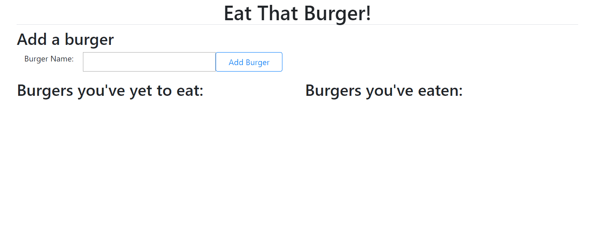

# Eat The Burger!

## Tools Used:
1. NodeJS
2. Express
3. Sequelize
4. HandlebarsJS
5. JQuery
6. Bootstrap

## User Story: 
### As a Burger Enthusiast: 
1. I want to make a log of burgers that I've either eaten, or would like to eat. 
2. I would like the burgers to be sorted by whether or not I've eaten them yet.
3. If I want to forget the horror of a burger I've eaten in the past, I want to be able to delete the burger from my records.

## View the deployed app [HERE](https://young-woodland-41492.herokuapp.com/)
